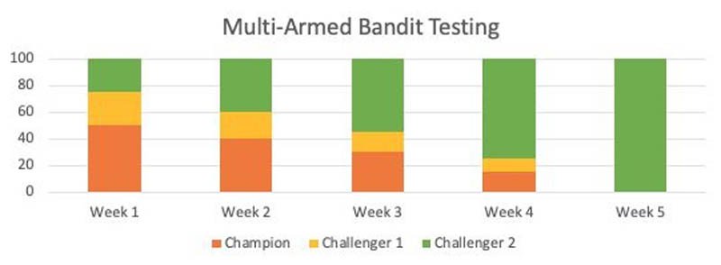
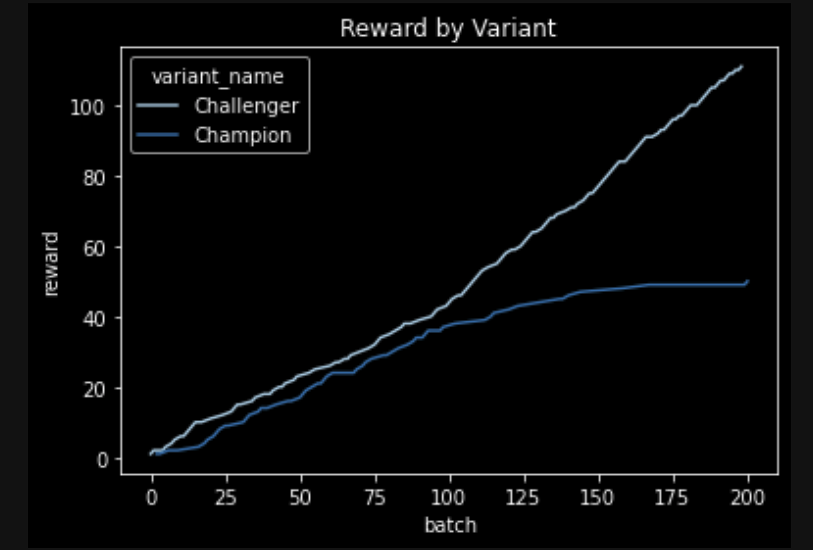
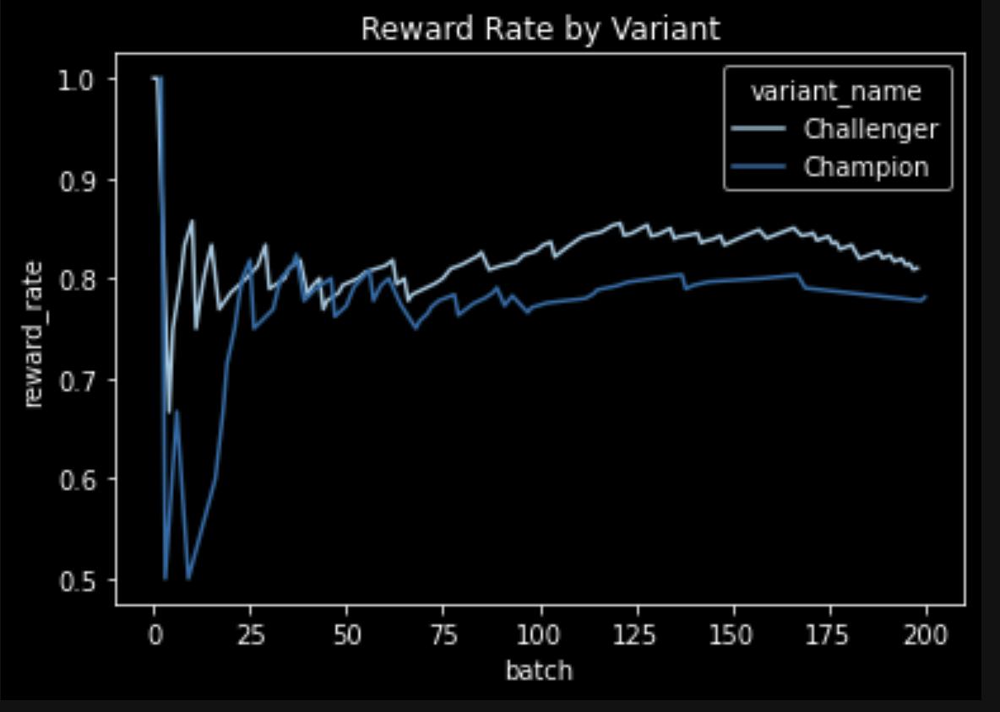
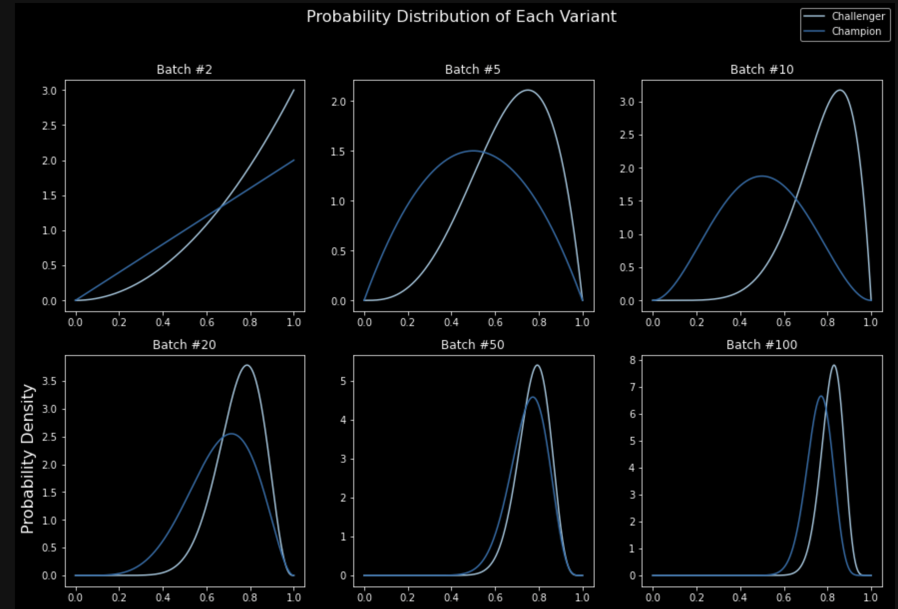

# Dynamic-AB-Testing-On-SageMaker

---

# 1. 배경

이 워크샵은 원문 블로그를 기반으로 하여, 조금 더 빠르게 프로토타이핑을 위해서 만들었습니다.
["Dynamic A/B testing for machine learning models with Amazon SageMaker MLOps projects"](https://aws.amazon.com/blogs/machine-learning/dynamic-a-b-testing-for-machine-learning-models-with-amazon-sagemaker-mlops-projects/)
먼저 위의 블로그의 내용을 약 5분-10분 정도 읽으신 후에 이 워크샵을 진행 하시기 바랍니다.

일반적인 정적인 A/B Testing 을 동적인 A/B Testing 을 위해서 MAB (Multi-Armed Bandits) 알고리즘을 사용할 수 있습니다. 아래 그림은 3개의 모델 (Champion, Challenger1, Challenger2) 을 Production 환경에 넣고 1주-5주 마다 동적으로 모델이 선택되는 것을 가시화 하고 있습니다.
이와 같은 내용을 SageMaker 에서 실습 하는 과정 입니다. 


< 이 이미지는 원문 블로그에 포함된 내용 입니다.>


# 2. 실습 내용 단계
- 머신 러닝 문제
    - "아마존 상퓸 리뷰" 가 유용한지 ("Helpfull"), 유용하지 않은지 ("Not Helpful") 를 예측하는 이진 분류 문제 입니다.
- 데이터 준비
    - 아마존 전자 제품 상퓸 리뷰
- 알고리즘
    - SageMaker Blazing Text 내장 알고리즘
- 두개의 모델을 생성
    - Champion: 디폴트 하이퍼파라미터로 훈련
    - Challenger: 하이퍼파라미터 튜닝을 통하여 훈련
- 배포
    - SageMaker Endpoint를 두개의 모델 변형(Model Variant) 을 포함하여 생성
        - 변형1 은 Champion 모델 사용
        - 변형2 은 Challenger 모델 사용        
- A/B 테스팅 및 시뮬레이션
    - (1) 간단한 "Variant DB" 에 초기값을 제공하여 생성 합니다.
    - (2) 추론을 위해 대상 변형 (Target Variant) 을 요청합니다.
    - (3) "Variant DB" 의 값을 기반으로 Tomson Sampling 알고리즘 을 통해서 대상 변형 (Target Variant) 를 제공합니다.
    - (4) 대상 변형을 얻은 후에 SageMaker Endpoint 에 대상 변형에 추론을 요청 합니다.
    - (5) 추론된 결과는 다시 "Variant DB" 에 업데이트를 합니다.
    - (2) ~ (4) 의 과정을 반복 합니다.

# 3. 시뮬레이션 결과
- 아래의 실행 결과는 실행시 마다 결과가 다르게 나옵니다. 이유는 "타겟 변형" 을 선정시에 베타 분포에서 랜덤 샘플링을 (Tomson Sampling) 하기에 달라지게 됩니다.

## 3.1 배치 수 진행에 따른 누적 리워드 가시화

아래 그림은 배치 수 진행에 따른 Champion, Challenger 의 누적 리워드를 가시화하고 있습니다.Challenger 가 배치 100번을 통과하면서 리워드를 더욱더 많이 얻는 것을 볼 수 있습니다.



## 3.2. 배치 실행에 따른 리워드 비율 가시화

아래 그림은 리워드 비율 ( 리워드 횟수 / 추론 총 횟수 ) 을 배치 실행에 따라 보여 주고 있습니다. 추론 한 예측 값과 진실값이 같을 경우에 (예측 성공) 리워드가 주어지기에 모델의 성능을 확인 할 수 있습니다. Challenger 가 근소하게 좋은 결과를 보이고 있습니다.


## 3.3. 배치 수 진행에 따른 베타 분포 (Beta Distribution) 가시화

- 아래의 그림은 Champion, Challenger 의 "도움 있음 횟수", "도움 없음 횟수" 를 제공하여 Beta 분포를 생성한 그림 입니다. 
- Beta 분포의 형태가 "세로로 얇아지고, 오른쪽으로 갈수록" 더욱더 더 많이 선택이 됩니다.
- 아래의 그림은 다량의 추론 (Batch 1번 ~ 100번) 을 하면서 Batch 추론 실행마다 Champion, Challenger의 베타 분포를 보여 주고 있습니다.
- Challenger의 베타 분포가 Batch # 100 시에 "세로로 얇아지고, 오른쪽으로 더욱 포진" 되어있기에, Challenger 가 Champion 보다 우수하다는 것을 보여 주고 있습니다.





# 4. 실습 코드

아래와 같이 코드 0.1 ~ 4.1 노트북을 차례로 실행 합니다.

# 코드 목록
```
 |-0.1.Setup Environment.ipynb : 필요 프로그램 설치
 |-1.1.Waming-up-MAB.ipynb: MAB 알고리즘 간단히 확인하기
 |-2.1.train-mab-reviews-helpfulness.ipynb: 상품 리뷰가 유용한지 이진 분류 모델 생성
 |-3.1.host-mab-reviews-helpfulness.ipynb : 모델 배포
 |-4.1.simulate-mab-reviews-helpfulness.ipynb: MAB 시뮬레이션
 |-api
 | |-utils.py : 유틸리티 함수
 | |-algorithm.py : MAB 알고리즘
 | |-test_algorithm.py : MAB 알고리즘 테스트 함수
 | |-variants_linline_db.py : 간단한 인라인 데이터 베이스 
```

